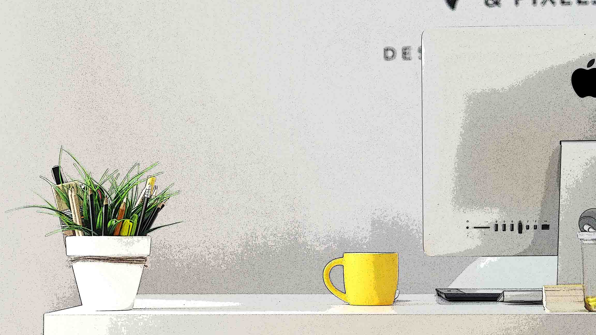

en estos tiempos modernos en los que velocidades y frecuencias solamente avanzan en una dirección (hacia arriba), es inaceptable que uno quede a la zaga por culpa de un sistema mediocre de productividad.
Un sistema robusto requiere software, hardware, y buenos hábitos.
No queremos alardear, pero tenemos experiencia en este tema. Un sistema robusto requiere software, hardware, y buenos hábitos.  
No queremos alardear, pero tenemos experiencia en este tema. Lo más importante es dejar todos tus proyectos y tareas en pausa hasta completar los siguientes tips & tricks:
- leer muchos blogs sobre productividad personal
- si uno es aficionado a los negocios o trabaja en una organización grande, leer libros sobre productividad y manejo de equipos
- ver todos los videos de [Ali Abdaal](https://www.youtube.com/@aliabdaal), [Thomas Frank](https://www.youtube.com/@Thomasfrank), y otros tres o cuatro “expertos” seleccionados al azar
- investigar todos los apps habidos y por haber en el mundo de la productividad, este ejercicio tiene varias dimensiones, por ejemplo:
	- apps en sí mismos —> estudio de videos y blogs de cada app por sí solo
	- comparación de apps (e.g., Notion vs. Obsidian, Evernote vs. Apple Notes) y no detenerse hasta haber completado todas las combinaciones posibles. Un canal como el de [Francesco](https://www.youtube.com/@keepproductive) puede ser de utilidad en esta dimensión
	- conexión y coordinación de apps (e.g., cómo tener un sistema de productividad a prueba de balas, o un zettelkasten, o un second brain)
- si tu sistema elegido va a incluir una libreta de notas física (”analógica”), no la compres hasta que revises bien los diferentes tipos de libretas y tipos de papel y también el lapicero o “writing instrument” que usarás.

Cada punto tiene que sopesarse y completarse con extremo rigor antes de poder empezar a hacer nada.
Pero que no panda el cúnico, este proceso metódico y largo no es nada tedioso. Al contrario, es emocionante, divertido, y placentero. 
Ser productivos es uno de nuestros hobbys favoritos, a pesar de que existan apóstatas como [Dann Berg](https://dannb.org/blog/2023/obsidian-meeting-note-template/) que dicen cosas feas como ésta:
> Productivity work is fun, and it feels like you’re doing work. But you’re not really doing work.

Eso es todo por hoy. Dōitashimashite.
