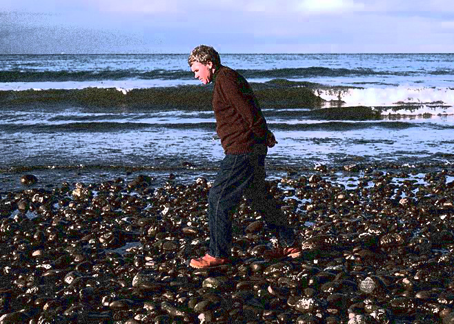
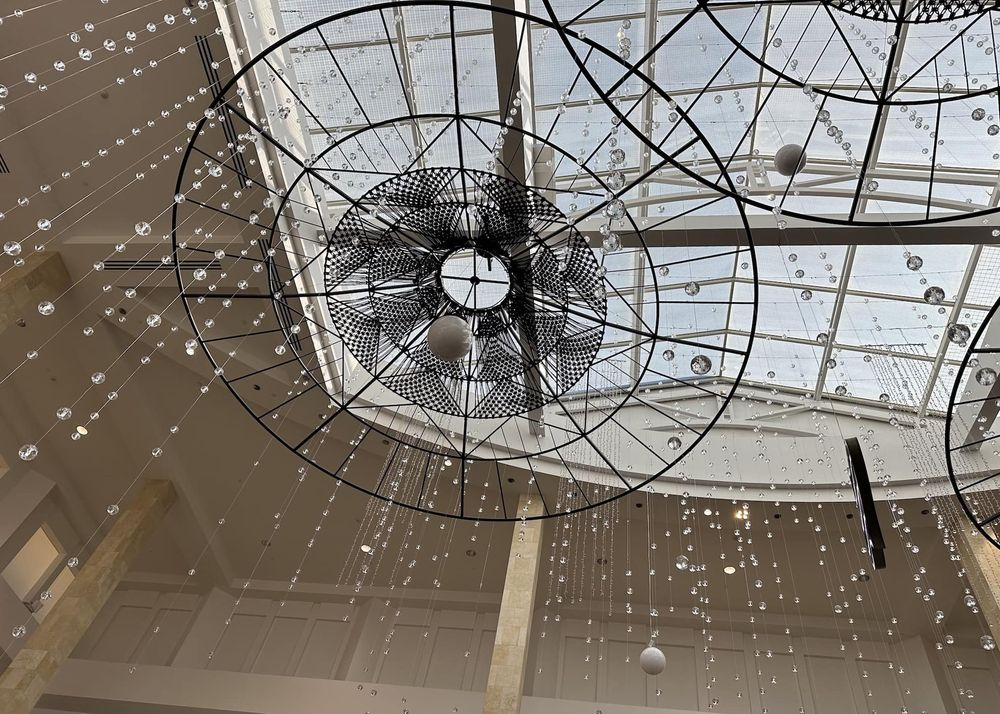
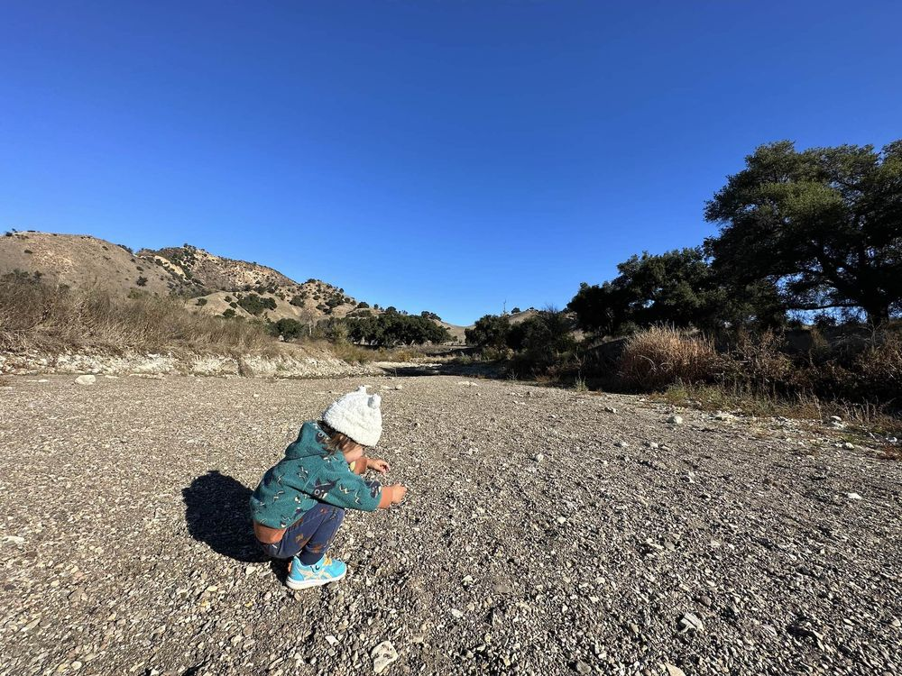

En uno de sus cuentos más famosos, [Raymond Carver](https://es.wikipedia.org/wiki/Raymond_Carver?) relata la conversación entre un ciego y el narrador. El ciego es amigo de su mujer y ha ido a visitarlos. Su presencia mantiene intranquilo al narrador a lo largo del relato.

Es una visita larga y llega un momento en el cual la esposa se queda dormida y el ciego y el narrador no tienen mucho de que hablar. La tele está prendida y se ve una procesión en España. El narrador intenta describir lo que va sucediendo. De la procesión pasan a mostrar varias catedrales europeas. De pronto, el narrador dice:

> Se me acaba de ocurrir algo. ¿Tiene usted idea de lo que es una catedral? ¿El aspecto que tiene, quiero decir? ¿Me sigue? Si alguien le dice la palabra catedral, ¿sabe usted de qué le hablan? ¿Conoce usted la diferencia entre una catedral y una iglesia bautista, por ejemplo?

El ciego mete un florazo (toman años y gente construir bla bla), pero después de un rato confiesa:

> Si quieres saber la verdad, eso es todo lo que sé. Lo que acabo de decir. Pero tal vez quieras describirme una. Me gustaría. Ya que me lo preguntas, en realidad no tengo una idea muy clara.

Con ese pedido el ciego cagó al narrador, cómo iba a describir una catedral a un ciego! El narrador prosigue:

> Me fijé en la toma de la catedral en la televisión. ¿Cómo podía empezar a describírsela? Supongamos que mi vida dependiera de ello. Supongamos que mi vida estuviese amenazada por un loco que me ordenara hacerlo, o si no…

> Observé la catedral un poco más hasta que la imagen pasó al campo. Era inútil. Me volví hacia el ciego y dije:

> “Para empezar, son muy altas.”

Y ahí quedó.

Menos mal que su vida no dependía de esto.

## Bolas en el aire

Y menos mal que la mía tampoco porque esta mañana fui al mall en Topanga y mi hijito de 1 año apuntó hacia arriba.

Apuntó hacia el techo altísimo del mall pidiendo que le explique o describa esto de aquí.

Por dónde empezar? No encontraba el vocabulario ni en español ni en inglés. Supongo que mi hijo no esperaría que su papá lo supiera todo, pero al menos que pudiese describir con propiedad lo que nos rodea, lo inmediato.

> “Son bolas en el aire... balls in the air”

¿bolas en el aire?

Esa explicación no lo satisfizo y siguió apuntando hacia aquello, pero como soy más grande y más fuerte, lo cargué y lo llevé a otro lado para que se distrajera.

Por dentro, sin embargo, sentía una gran derrota, y me puse a pensar en el personaje de Catedral.

## Arbol grande, árbol pequeño

Mientras seguíamos caminando por el mall, mi cerebro le daba vueltas al asunto. Llevo a mi hijo casi a diario a las montañas en Malibu Creek State Park. Visito esas montañas desde hace más de diez años. Acampo, hago caminata, corro, manejo a través de ellas.

Hay muchísima vida silvestre: vegetación, aves, mamíferos, de todo.

Y sin embargo, cuando camino por ahí y mi hijo se asombra con algún árbol, y luego con otro, y apuntan con su dedito hacia uno de ellos, y luego hacia el otro, lo único que sale de mi cerebro a través del hocico es: “ese es un árbol grande, ese otro es un árbol pequeño…”

Nota final: cero cero. Y eso que los profesores de ciencias naturales del colegio Recoleta eran muy buenos.

## Nos superaremos

El hecho de escribir este post me llevará a corregirlo todo. Aprenderé a nombrar las cosas, me expresaré con precisión, seré otro. Gracias cojudeces.com!