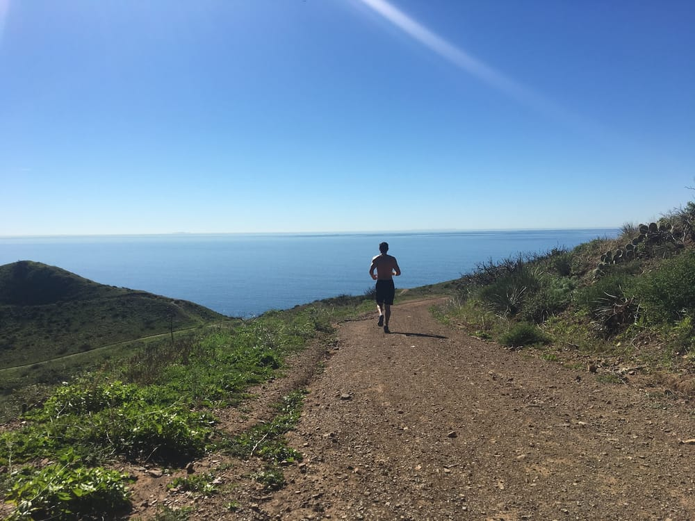
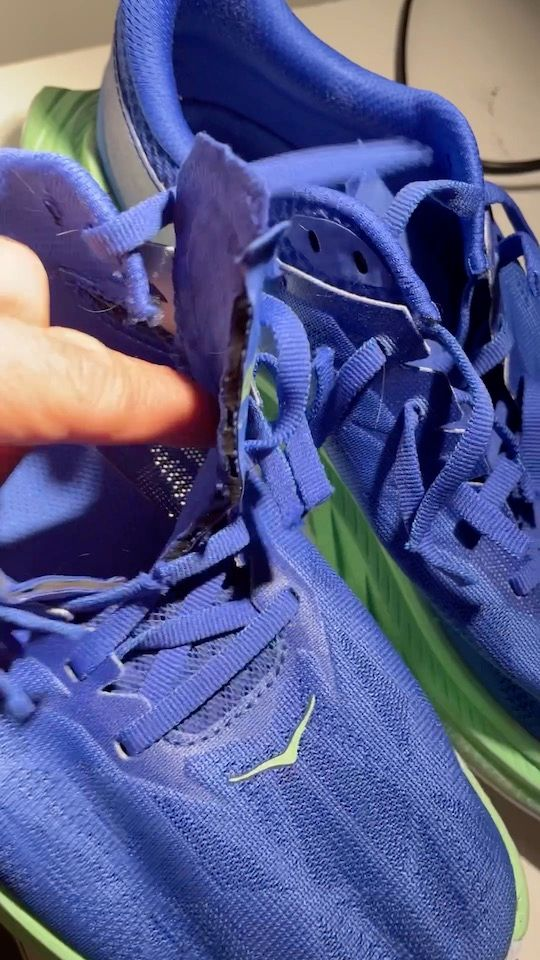

Lo recibí en navidad. Incluso filmé la apertura del regalo porque era la primera navidad de Kai y quería registrarla para el recuerdo.

El regalo antiperfecto es simple: una media maratón.

Me inscribieron para correr 21 kilómetros el 7 de mayo en [Santa Barbara](https://www.runsipsantabarbara.com/?ref=cojudeces.com).

Por donde se lo mire, este es el regalo antiperfecto.

## Yo no corro

Cuando lo hago, lo hago infrecuentemente como parte de mi “programa de fitness”, y no paso los 10 kilómetros en una sola salida. La mejor parte sin duda alguna es el final de cada sesión, cuando presiono el botón de stop en el Garmin.

## Yo no duermo

Desde hace cinco meses no logro dormir más de tres horas seguidas. Es culpa de Kai. Lo máximo a lo que podría aspirar es dormir seis horas (partidas en dos o tres sesiones, nunca de corrido). Así no se puede entrenar.

Recuerdo un video de Casey Neistat en el cual dice que el ejercicio puede reemplazar al sueño. Es decir, correr dos horas y dormir cinco son el equivalente a dormir siete horas. Qué fácil es hablar.

## No es una maratón

Si el regalo hubiese sido una maratón completa, habría sido natural rechazarla instantáneamente: mucha distancia, no soy corredor, requiere demasiado tiempo prepararse, etc.

Pero no es una maratón, sino una **media** maratón. Algo alcanzable para cualquiera. Un regalo imposible de rechazar.

## Los resultados

Ya hablé acerca de esto con algunos amigos. Van a estar pendientes de mi tiempo. También busqué las velocidades por edad y por nivel. Aquí están:

Hombres de 45 años (velocidad en minutos por milla)

- Principiante: 11:52
- Novato: 9:56
- Intermedio: 8:29
- Avanzado: 7:25
- Elite: 6:38

La cruda realidad es que mi promedio este mes de enero es de 8:45 minutos por milla recorriendo solamente 4 millas. O sea, las cosas están jodidas. Necesito una velocidad de ~~7:45~~ 8:15 o mejor para evitar ser motivo de burla.

Es un sueño de opio.

## La familia

El problema de la familia es el siguiente. Varios familiares directos han completado maratones (de 42km) o Ironmans 70.3. Por ejemplo, mi hermana ha corrido en Chicago, Buenos Aires, Lima, Huntington Beach.

El regalo fue de mi esposa, quien ha completado la maratón de Los Angeles y la de Orlando, y como es mi esposa, no se le puede decir que no.

## La maratón completa

Completar la media maratón no será ningún logro. O peor, será un logro mediocre que resultará en tener que inscribirse para correr una maratón completa.

## Costo de oportunidad

Con un bebe de cinco meses en la casa, sin niñera, sin familia cerca que pueda venir a ayudar, la cantidad de tiempo “libre” es negativa. El tiempo “libre” que surge de vez en cuando es en realidad tiempo que se debió pasar durmiendo en días pasados. Es una ilusión.

Ese ilusorio y escaso tiempo libre a partir de ahora deberá gastarse en prepararse para la media maratón.

## **Conclusión: lo niego todo**

Pero me rebelo y prefiero sentarme y escribir esta diatriba de medio pelo.

Y cortar las lengüetas de mis zapatillas. Hasta nunca!

