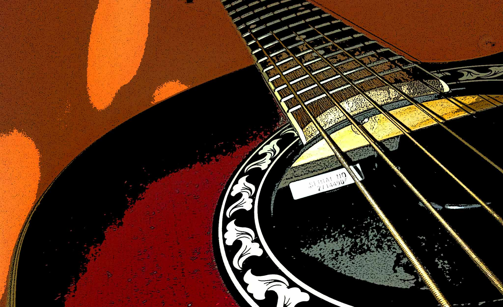

La pregunta completa es:

> Es posible identificar la mejor canción de toda la obra de un artista al escuchar solamente una canción?

Lo que nos llevó a hacernos esta pregunta fue, nuevamente, un viaje largo en la [Jeep](https://www.cojudeces.com/jeep/) en el cual la canción #3 comenzó a sonar. Subimos el volumen y, mientras tocaban, nos dábamos cuenta de que cada segundo de los 537 que componen el tema sostenían un nivel perfecto. Ninguna nota escapaba de la unidad, equilibrio, y continuidad del todo.

Al parecer, entonces, la respuesta a la pregunta es un rotundo y poético sí.

Por ejemplo: temas #1 y #3. Rotundo sí.

Pero las cosas nunca son tan simples. Por ejemplo, temas #2 y #4. Son canciones extraordinarias de músicos quizá superiores a los de #1 y #3… bueno, quizá por esto último es que las cosas son menos simples.

## Tema 1

[https://www.youtube.com/embed/QkF3oxziUI4](https://www.youtube.com/embed/QkF3oxziUI4)

## Tema 2

[https://www.youtube.com/embed/IDjI8fr33NI](https://www.youtube.com/embed/IDjI8fr33NI)

## Tema 3

[https://www.youtube.com/embed/4_fvXrgAm1A](https://www.youtube.com/embed/4_fvXrgAm1A)

## Tema 4

[https://www.youtube.com/embed/HtUH9z_Oey8](https://www.youtube.com/embed/HtUH9z_Oey8)

### Comenta por email, envíanos cualquier cojudez a mediodiablo@cojudeces.com... y sí, Charly es el _be all end all_