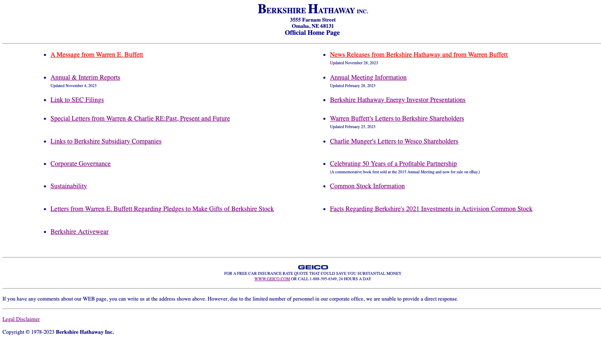

Berkshire Hathaway, con una capitalización de mercado de $780 billones (noviembre 2023), ha llevado el concepto de "fondo sobre forma" o "supremacía del contenido sobre la forma" a su máxima expresión en el universo de páginas web.

