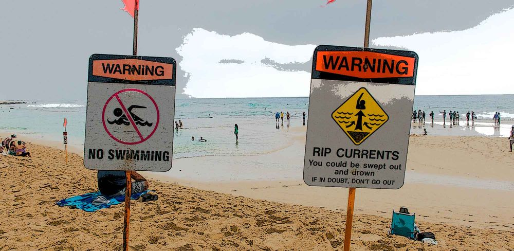

La descripción según Wikipedia:

> … cámara de eco… es la descripción metafórica de una situación en la que la información, ideas o creencias son amplificadas por transmisión y repetición en un sistema «cerrado» donde las visiones diferentes o competidoras son censuradas o están prohibidas o minoritariamente representadas

Últimamente hemos notado algo peculiar pero totalmente predecible. Cuando hablamos con gente del trabajo acerca de temas no relacionados con la chamba inmediata, el denominador común inevitablemente es el tema “desarrollo profesional” (_career advancement)_.

Mientras más conversaciones uno sostiene con colegas, más se va uno amargando. Al parecer, fuera del estado de luna de miel post ascenso (cuya vida promedio es de 60 días), todo el mundo piensa que está siendo postergado o sobrepasado. “Para que haya justicia en el mundo, debería tener un puesto más alto y un mejor sueldo”, es el mensaje que oímos. Se conversa acerca de fulano de tal y fulana de tal, que se fueron a otra compañía donde todo es mejor.

Y como no se toca ningún otro tema, uno empieza inconscientemente a pensar que la única variable importante en la vida es “desarrollo profesional” y que la función de la vida es maximizar dicha variable.

Esa idea cada cierto tiempo nos contamina y creemos que el _grass is greener_ e incluso consideramos mudarnos a la [costa incorrecta](https://es.wikipedia.org/wiki/Costa_Este_de_los_Estados_Unidos?ref=cojudeces.com) (o peor: al medio del país) con el solo objetivo de incrementar la insidiosa variable.

Es la cámara de eco en acción.

## Diversifica

Hace poco, en abril, publicamos el post [Diversifica](https://www.cojudeces.com/diversifica/). La idea principal del post provino justamente de la realidad opuesta a la cámara de eco. Estábamos pasando más tiempo con la familia y los amigos, y eso nos dio una perspectiva diferente. La perspectiva correcta.

> Diversificar es saber que todos, en donde quiera que estén, eventualmente experimentarán contratiempos, frustraciones, decepciones. Y es estar preparado para esos reveses con las herramientas adecuadas y con la mente clara.

Nuestra función no es la de maximizar una variable en particular, sino la de optimizar las variables que son importantes para nosotros y nuestro escuadrón. Una lista no muy larga de variables (que quizá va cambiando con el tiempo).

## De costa a costa

Cuando les dábamos vueltas a las oportunidades en la otra costa (la costa incorrecta), decidimos llamar a nuestro gran amigo de siempre y colaborador Lestepario.

Le explicamos que en la otra costa el número de oportunidades de desarrollo profesional era muchísimo mayor. “Se puede acceder a mejores puestos y mejores sueldos,” dijimos.

“Y para qué quieren eso? Cuál es la siguiente jugada y la que le sigue?” preguntó.

“Bueno, la idea es hacerlo por tres o cuatro años nada más”, respondimos.

“Y después qué?”, reiteró astutamente la pregunta.

“Después de tres o cuatro años nos mudamos de regreso a esta costa, la costa correcta”, contestamos.

Y en ese instante, al oír nuestra propia respuesta, nos dimos cuenta (again) de porqué tenemos el [nombre de dominio](https://www.cojudeces.com/la-camara-de-eco/www.cojudeces.com) que nos merecemos.
