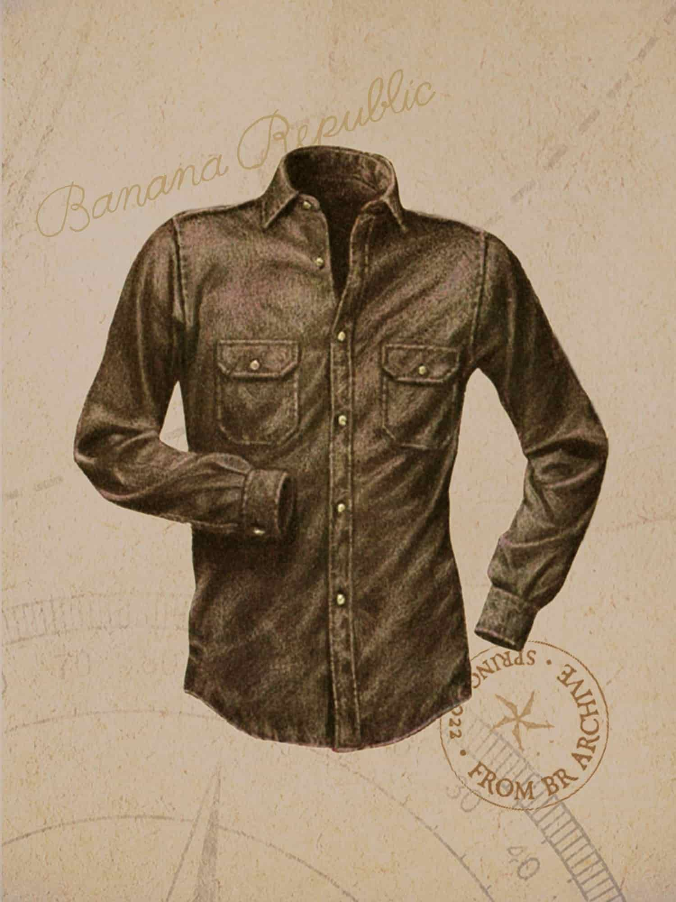
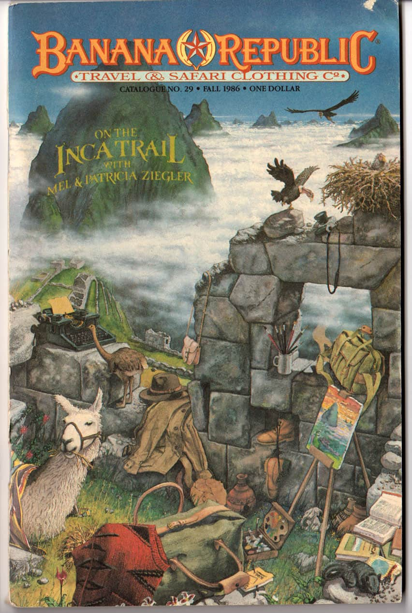
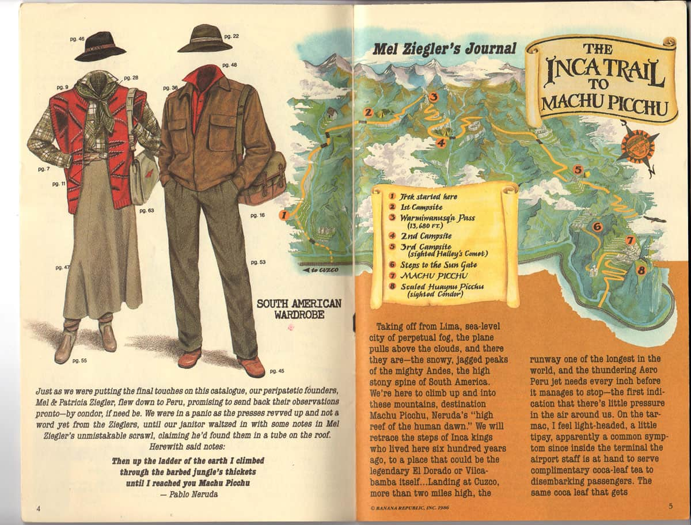
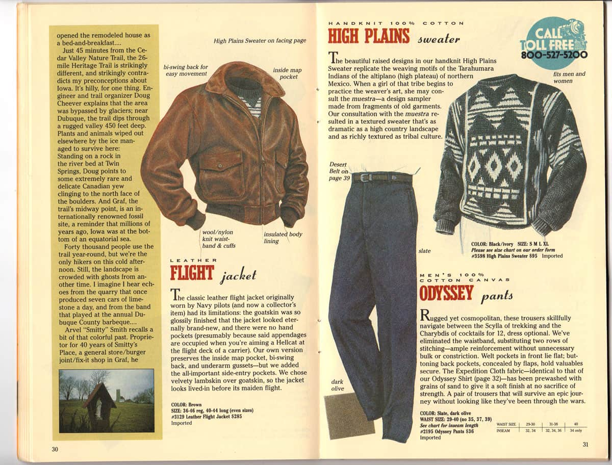

No. No es el Perú.

No es posible ser número en todo. Pero obviamente lo intentamos con todas nuestras fuerzas.

Este post se lo debemos a la vanidad. Aquella que de vez en cuando nos hace tropezar en lo precioso.

Necesitábamos urgentemente ropa nueva para una sesión de fotos, ya que todo nuestro guardarropas había sido purgado y sacrificado a Hefesto en nombre del minimalismo.

## Banana Republic Travel & Safari Clothing Company

La vida es absurda, y a la vez no lo es.

Nuestra reacción fue entrar a la página de Banana Republic y buscar endemoniadamente ropa que NO parezca de Banana Republic.

Y la encontramos.

Un grupo de prendas que se distinguían porque, raramente, no carecían de personalidad. Tenían carácter, _****soul.****_ No eran las típicas huevadas genéricas que usa el cojudo que va siempre bien peinadito y que estudia para sacar 20 en conducta.

Este grupo era llamado a veces “heritage” y otras “archives”. Y lo otro que nos llamó la atención fue que algunos productos mostraban ilustraciones hechas a mano como ésta:

la famosa expedition shirt

El dibujo de la camisa (expedition shirt) nos llevó a investigar en Wikipedia, donde aprendimos que Banana Republic no era una invención del departamento de marketing the The Gap, sino que fue fundada por dos periodistas de el San Francisco Chronicle allá en 1978 y que fue adquirida años después por The Gap. Uno de los periodistas era Mel Ziegler (reportero) y la otra Patricia Gwilliam (ilustradora).

El nombre original era **Banana Republic Travel & Safari Clothing Company**.

Un par de horas después encontramos esta gema: Abandoned Republic.

## Abandoned Republic

Este website es raro: vive en un subfolder de una página completamente ajena ([secretfanbase.com](http://secretfanbase.com/?ref=cojudeces.com)). Dado el diseño y la velocidad de carga, pareciera que la página fue armada en los años 90. Pero hay algo, creemos, que sugiere que ese look anacrónico tiene un propósito, una intención quizá de honrar al viejo y original travel and safari clothing company.

Abandoned Republic presenta un archivo de los catálogos que Banana Republic publicó desde sus inicios en 1978 hasta 1988, cuando los fundadores fueron chifados y Gap suspendió los catálogos.

Una gran pérdida pues las publicaciones eran unas bellezas, con ilustraciones dibujadas a mano y pequeñas reseñas e historias acerca de los productos y de lugares lejanos por explorar. Una pérdida, sí, pero quizá el justo lugar de estos catálogos es el pasado que fue mejor.

Aquí un extracto del [Catalogue No.4, 1980](https://www.secretfanbase.com/banana/1980-catalogue-no-4/?ref=cojudeces.com) (traducción de [cojudeces.com](http://cojudeces.com/?ref=cojudeces.com)):

> Cuando nuestro primer catálogo salió a la luz en 1978, apostábamos a que había gente como nosotros que compartía nuestro interés en ropa de safari que sea clásica y funcional, que había otros como nosotros que sufrían las mismas dificultades tratando de encontrar este tipo de ropa que es tan difícil de rastrear. Hemos recorrido el mundo -desde Australia, a través de Sudamérica, Europa, y luego hasta Africa en busca de prendas auténticas, genuinas, y bien hechas… y lo que nos asombra -habiendo ya hecho una pausa a nuestra frenética hurga mundial- es que nos hemos encontrado mutuamente. De las Islas Vírgenes a Alaska, de Maine a Hawaii, miles de ustedes han hecho posible que les llevemos nuestra tienda por correo. Vuestras cartas y llamadas telefónicas generan una sensación de aldea en nuestras oficinas. Los miles de kilómetros que nos separan se desvanecen gracias a los principios que compartimos: pasión por las cosas naturales [o de la naturaleza], comunicación simple y directa, ropa honesta (es decir botones, hebillas, bolsillos, puntadas, etc. que cumplen una función, no que solamente decoran). Lo frívolo no es nuestro estilo en ropa. La palabra es “función”. Valoramos lo que es real. Somos aquellos que compran el churrasco, no la chispa, la champaña, no las burbujas, el producto, no el paquete.” (Mel Ziegler y Patricia Gwilliam).

Y aquí unas fotos del [Catalogue No.26, Fall 1986](https://www.secretfanbase.com/banana/banana-republic-catalog-26-fall-1986-the-inca-trail/?ref=cojudeces.com) en el que nuestro querido Cusco es la estrella.

edición Inca Trail

## Indiana Jones

Con esta nueva perspectiva era inevitable creernos Indiana Jones y sentir la necesidad de comprar la ropa necesaria para cumplir nuestro papel, así que…

- [Heritage Expedition Shirt (Tan)](https://bananarepublic.gap.com/browse/product.do?pid=7958340220002&ref=cojudeces.com)
- [BR ARCHIVES Henley T-Shirt (New Off White)](https://bananarepublic.gap.com/browse/product.do?pid=4421170020002&ref=cojudeces.com)
- [Heritage Suede Trucker Jacket (Tobacco)](https://bananarepublic.gap.com/browse/product.do?pid=7461010120002&ref=cojudeces.com)
- [BR ARCHIVES Flight Jacket (Dark Brown)](https://bananarepublic.gap.com/browse/product.do?pid=5830730020002&ref=cojudeces.com)

El último producto de la lista es el renacimiento del Leather Flight Jacket del otoño de 1988 (abajo la foto).

## Extractos de entrevistas que encontramos durante otra noche de insomnio

“[en Australia] fue ahí donde encontré una vieja casaca de la Birmania Británica -una prenda de safari por excelencia y que fue hecha para el ejército británico. Vestida por las tropas británicas en el teatro burmés durante la Segunda Guerra Mundial. La usé durante mi viaje de regreso a San Francisco y, cuando Patricia me recibió en el aeropuerto, no dejaba de verme la casaca. Patricia le cambió los botones, añadió unos cortes de cuero, y se veía muy bien. Sabía que estábamos sobre algo importante porque dondequiera que iba, la gente decía “dónde conseguiste esa casaca? Es fenomenal!” Y eso me dio la idea de venderlas, así que salimos en busca de ellas…

Primero creamos un catálogo. Era una progresión natural porque yo escribo, y Patricia dibuja, así que creamos un pequeño catálogo y lo enviamos a 500 amigos alrededor del país y a alguna gente de los medios de comunicación. Uno de los catálogos aterrizó en el escritorio de un anunciante de radio en New York, quien lo leyó a los viajeros del tri-state (New York, New Jersey, Connecticut) una mañana. El anunciante llamó a Patricia por teléfono, y durante una entrevista de 20 minutos, ella dijo que cualquiera que quisiera una copia debería enviar $1 al PO Box 745 en Mill Valley, California. Tres días después, el cartero entró con dos pilas de correo. Abrimos los sobres y el total era suficiente para cubrir los gastos de los catálogos y del envío -y un poquito de sobra como para pagar la comida por algunos meses.”

Patricia Gwilliam Ziegler and Mel Ziegler

**También hay un libro**. Se titula Wild Company, las memorias escritas por los fundadores. Publicada el 2012.
