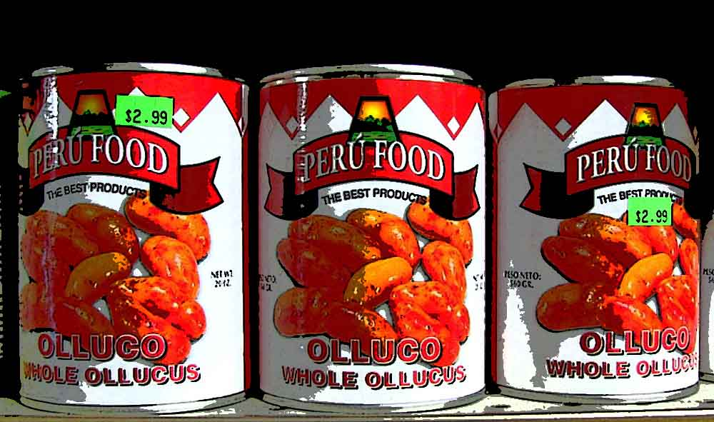

## _(Publicada originalmente en noviembre del 2006)_

Continuando con la biografía de nuestro superhéroe el Olluco, diremos que sus poderes provienen de dos fuentes muy simples: nutrición y ejercicio.

## **Nutrición**

El Olluco cuida mucho su dieta y está siempre al tanto de lo que consume, evita los alimentos altos en grasa y de poco contenido nutritivo, “calorías vacías”, los llama. Sus platos preferidos son, como era de esperarse, el olluquito sin charqui, el ceviche mixto, y el concentrado de cangrejo del restaurante [Mi Perú](https://youtu.be/RL0-Uxf7AZM?ref=cojudeces.com), en Barranco (ciudad de Lima).

Sin embargo, cuando el deber lo llama, el Olluco obtiene su fuerza sobrehumana y su inquebrantable valor de la cerveza y del orégano. Un reportero de Marvel Entertainment le preguntó una vez por qué había escogido estos dos elementos, a lo que el Olluco contestó algo ofuscado: “**no seas cojudo, ¿tú crees que los indefensos separan cita conmigo?** ¿o crees que, cuando alguien en aprietos me invoca, yo digo espera un ratito que me como un ají de gallina?...No pues, la diferencia entre la vida y la muerte es cuestión de segundos, por eso mi energía y mis poderes los obtengo de un vaso de cerveza (seco y volteado!) y de una jaladita de orégano tostado. Cinco segundos y estoy listo para luchar por la justicia.”

### Aquí se puede ver al Olluco consumiendo su orégano tostado

## **Ejercicio**

En la misma entrevista concedida a [Marvel Entertainment](http://www.marvel.com/?ref=cojudeces.com), el Olluco habla sobre su programa de acondicionamiento físico.

> “Ser un superhéroe no es cosa de juego, mucha gente indefensa depende de uno, es como ser presidente de la nación, entiendes? No se puede defraudar a los que confían en uno. Bueno, los políticos de hoy han demostrado que sí se puede, pero en todo caso, no se debe...

> Yo vivo frente a un parque (no puedo dar más detalles por obvios motivos de seguridad) y salgo a correr unas cuantas vueltas al amanecer. Luego, por la tarde voy al gimnasio JC donde mi entrenador personal, el gran Roger, me saca la eme durante hora y media. Saliendo del gym paso por la bodega de la esquina o la del óvalo y me compro una cerveza negra Polar y me la seco al instante, como Arnold Schwarzenegger, pero sin fumar ningún troncho a menos que sea de orégano... Y por las noches, cuando las cosas andan calmadas y no hay ningún indefenso jodiendo la paciencia, salgo a hacer piques; generalmente trato de competir contra automóviles que van pasando por la avenida El Golf.”
