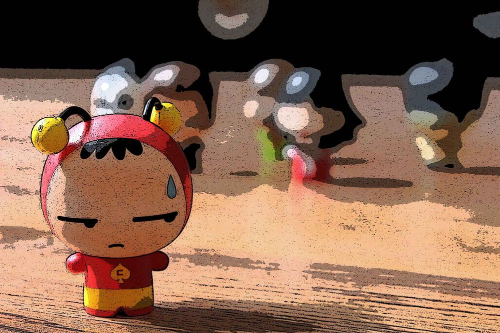

## _(publicada originalmente en noviembre del 2006)_

### Introducción-Contexto

Latinoamérica siempre ha estado escasa de superhéroes y hemos tenido que importarlos imaginariamente desde Estados Unidos; decimos imaginariamente porque no sabemos de ningún caso en el que se haya visto a Superman o al Hombre Araña por los cielos de Bogotá o en las paredes del edificio El Dorado en Lince, ciudad de Lima; solamente imaginábamos que venían a protegernos de la maldad y así dormíamos tranquilos, qué nos quedaba, era una de las condiciones de vivir en un país subdesarrollado.

En los años 70, sin embargo, para gran alegría del pueblo latinoamericano, apareció nuestro primer superhéroe allá en Ciudad de México: el Chapulín Colorado.

El Chapulín Colorado con su chipote chillón puso a raya a los malhechores de Latinoamérica y no es ningún secreto que el nivel criminalidad en las metrópolis bajó considerablemente durante los 70s y 80s. Sin embargo, con la población mundial llegando a los 5mil millones durante los años 90, el Chapulín ya no se daba abasto, Sudamérica quedaba un poco lejos de México y el crimen retomó fuerza en las ciudades meridionales de América.

### Momento decisivos

Fue entonces cuando surgió de la mismísima ciudad de Lima (quién se iba a imaginar) nuestro segundo superhéroe latino: el Olluco.

Cuentan que el Olluco nunca había considerado convertirse en superhéroe, “¿para qué quitarle chamba al Chapulín?”, pensaba, “además, el cuate parece buena gente... mejor seguir una vida normal y estudiar algo como ingeniería de sistemas, la carrera del futuro dicen.”

En una entrevista confesó tener tendencias exhibicionistas e histriónicas, pero dijo que las mantiene bajo control ya que la ética de los superhéroes no le permite dar rienda suelta a sus manías. Pudimos constatar este comentario en unos videos que nuestros contactos limeños enviaron (pronto será publicado en su querida cojudeces.com), en el que se ve al Olluco, cuando todavía no era Olluco, haciendo una tanda de cojudeces rayanas a la drag-queenería.

Pero un buen día, nuestro héroe se encontraba en el bus (el micro, en argot limeño) viajando asardinadamente, hacía un calor extremo en un febrero con fenómeno del Niño y las ventanas estaban todas abiertas. Levantó la cabeza para ver cuánto faltaba para llegar a su destino, aún falta mucho, pensó. En la esquina había un grupo de adolescentes, estiraron el brazo para detener el micro y, cuando éste estaba deteniéndose por completo, los malditos muchachos (los HDP) desenvainaron globos de colores, algunos llenos de agua, otros de pichi, y con violencia y muchas risas acribillaron a los pasajeros del micro. El Olluco fue conectado en plena frente (nunca supimos si le tocó agua o pichi). Indignado y mojado, pensó “esta mierda no puede quedarse así”. Ahí comenzó todo.

### Breve descripción - bosquejo

Al igual que el Chapulín Colorado, el Olluco es algo chaparro, 1.65mts aproximadamente, lo que es normal para un superhéroe de esta región. No tiene antenitas de vinil ni chipote chillón, tampoco dice ‘no contaban con mi astucia!’ ni tantas cojudeces como su colega mexicano. El Olluco se viste como una persona normal y sólo en las misiones más peligrosas usa un casco rosado (ver video adjunto), su poder lo obtiene de dos fuentes: la cerveza y el orégano tostado; su frase preferida es “échale + ___”, lo que puede ser échale toro, échale vampiro, échale Valencia, es decir: échale + espacio.
