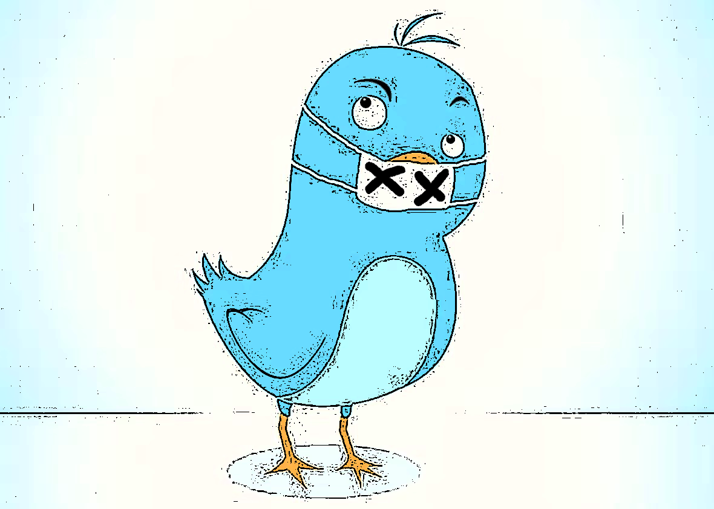
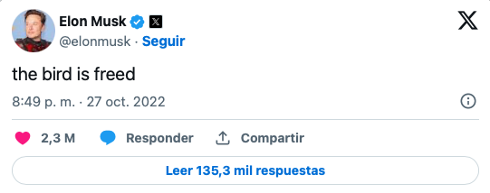

Bueno pues, el CSM lo logró. Compró Twitter y liberó al pajarito. (La traducción al español de su tweet 👇🏼 puede sonar un poco maloy pero afortunadamente el riesgo de que lo bloqueen es nulo 😃).

En estos tiempos dementes y lunáticos nos sorprende que nos sorprenda (pero de todos modos nos sorprende) la cantidad incontable de pedidos para censurar, restringir, frenar, y cancelar el nuevo Twitter.

Igual de desconcertante es que estos reclamos se hacen en nombre de la democracia y la libertad de expresión. Por ejemplo [aquí](https://www.newsweek.com/twitter-under-elon-musk-would-arena-hate-democratic-strategist-1698517?ref=cojudeces.com) (estratega demócrata), [aquí](https://twitter.com/senwarren/status/1518702084048179200?ref=cojudeces.com) (Elizabeth Warren), y [aquí](https://www.freepress.net/sites/default/files/2022-11/coalition_open_letter_to_twitter_top_20_advertisers_final.pdf?ref=cojudeces.com) (carta abierta de 40+ organizaciones sociales a los top 20 anunciantes de Twitter).

Evidentemente en [cojudeces.com](http://cojudeces.com/?ref=cojudeces.com) somos un poco cojudos. Creíamos que uno de los motivos de Elon al comprar Twitter era precisamente retirar la práctica tiránica de cancelaciones y censuras de la cual hacen uso y abuso comités o individuos dentro del bluebird. Y así aumentar la libertad de expresión.

## Cómo reparar Twitter

David Heinemeier Hansson publicó un [post](https://world.hey.com/dhh/here-s-how-to-fix-twitter-79632ecb?ref=cojudeces.com) en el que delinea las siguientes pautas para arreglar la compañía:

- premisa: la internet contiene todo tipo de personajes y contenido, desde lo más lindo hasta lo más repugnante
- premisa: la internet se gobierna con leyes locales, no con comités de “moderadores” (o censores), esto es una virtud, no una falla
- solución: convierte twitter en un protocolo de comunicación para transmitir cualquier tipo de contenido, y deja que los usuarios regulen lo que quieren ver  
    - del mismo modo que puedes encontrar cosas extremas y terribles en la web si haces una búsqueda en Google… pero no la haces porque estás regulando lo que quieres ver  
    - esto no funciona en Twitter hoy en día porque Twitter the presenta contenido que nunca pediste ver
- solución: Twitter solamente te muestra contenido de gente que sigues
- solución: los autores moderan sus propios posts (algo similar a cómo la gente que tiene blogs regula comentarios de sus lectores)
- solución: el proceso editorial debe ser positivo y no negativo (es decir, se seleccionan tweets que Twitter quiere resaltar, no los que quieren prohibir)

Interesante, pero si Twitter se limita a mostrar solamente contenido de la gente que sigues, el modelo actual de revenue se vería impactado brutalmente. Las propiedades adictivas del app se disiparían.

## Más allá de Elon y de Twitter: libertad de expresión y distribución del poder

Lo que nos ha llevado a escribir acerca de este tema tan de moda en los mass media no es ni Elon ni Twitter, sino las fuerzas subyacentes a toda esta dinámica.

### Libertad de expresión

La libertad de expresión es el master value. La condición indispensable de cualquier otra forma de libertad y del progreso. Sin ella, muchos derechos fundamentales desaparecen. Por ende, restringir o simplemente amenazar con restringir la libertad de expresión es un error muy grave.

Es por esto que la otrora loable ACLU demandó en 1977 al gobierno de EE.UU. para que se [les permitiera a un grupo de nazis](https://www.aclu.org/issues/free-speech/rights-protesters/skokie-case-how-i-came-represent-free-speech-rights-nazis?ref=cojudeces.com) (sí, nazis) hacer una marcha en el pueblo de Skokie en Illinois. Oficiales y aliados del pueblo de Skokie intentaron usar todo el arsenal legal disponible para bloquear la marcha, y ACLU defendió con aplomo el principio de que la libertad de expresión es un derecho universal sin importar qué tan ofensivo sea el mensaje o el mensajero.

### Distribución del poder

El segundo punto, relacionado al primero, es el de ser consciente de la distribución de poder entre el individuo y el estado. No hace falta más que ver lo que pasa en países como China y Arabia Saudita, o lo que pasaba en la Unión Soviética, para concluir que asignar demasiado poder al estado al costo de los derechos y libertades del individuo es otro grave error.

En estos días en los que nadie soporta sentirse ofendido, en los que la respuesta es silenciar y cancelar al otro, hay que dar un paso atrás y cambiar de perspectiva. Si nos sentimos ofendidos y queremos silenciar a quien nos “agrede” y estamos dispuestos a usar el poder del estado para lograr nuestro propósito (p.ej., imponer una ley que requiera o prohiba que la gente use cierto lenguaje), lo que estamos haciendo es debilitar la posición de los individuos y, como dice el profesor [José Ignacio Beteta](https://joseignaciobeteta.pe/?ref=cojudeces.com), creando un botín cada vez más grande para el gobierno presente y gobiernos futuros.

## Para cerrar: Bertrand Russell

Para cerrar el post y reiterar la importancia de la libertad y su matriz, la libertad de expresión, recordamos un ensayo del gran Russell titulado The Future of Mankind. En él describe la posibilidad de una tercera guerra mundial y posterior victoria de los Estados Unidos o de la Unión Soviética.

Aquí un extracto donde explica por qué preferiría una victoria gringa (énfasis nuestro).

> “My reason for siding with America is that there is in that country more respect than in Russia for the things that I value in a civilized way of life. The things I have in mind are such as: **freedom of thought, freedom of inquiry, freedom of discussion, and humane feeling**. What a victory of Russia would mean is easily to be seen in Poland. There were flourishing universities in Poland, containing men of great intellectual eminence. Some of these men, fortunately, escaped; the rest disappeared. **Education is now reduced to learning the formulae of Stalinist orthodoxy**; it is only open (beyond the elementary stage) to young people whose parents are politically irreproachable, and it does not aim at producing any mental faculty except that of glib repetition of correct shibboleths and quick apprehension of the side that is winning official favor. From such an educational system nothing of intellectual value can result.” (The Future of Mankind, 1951)

Aquí un [link](https://www.theatlantic.com/magazine/archive/1951/03/the-future-of-man/305193/?ref=cojudeces.com) al ensayo completo.

Hasta pronto.