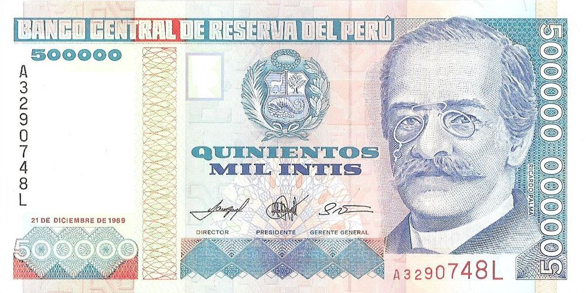
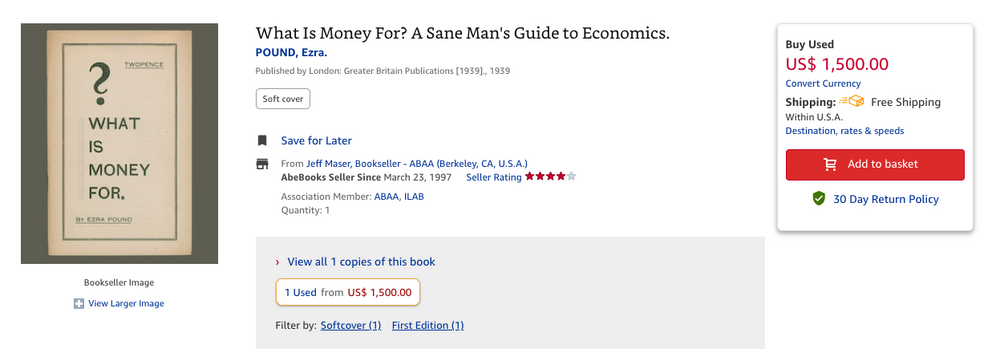

Al igual que en el [Día del Padre](https://www.cojudeces.com/lecciones-del-dia-del-padre/), el domingo pasado nos obligaron a ir a otro “concierto en el parque”. Fue grandioso. Estamos pasando la [ola de calor más fuerte que hemos vivido](https://www.latimes.com/espanol/california/articulo/2022-09-02/algunos-de-los-records-cayeron-despues-de-mas-de-70-anos?ref=cojudeces.com) desde que nos mudamos a California el 2005 y aun así decidimos salir.

Ojo, no estamos hablando de los Rolling Stones en concierto, sino de bandas locales que la ciudad contrata para que entretengan un rato a la gente del vecindario…

… y sin embargo, al llegar ya no había donde estacionar. Cuadras y cuadras a la redonda estaban repletas de autos y de gente caminando, bolsita de picnic en mano y silla de camping en la espalda, en dirección al parque. En plena ola de calor.

Finalmente encontramos un lugar donde estacionar, lejos del parque. Y nos unimos a esa muchedumbre, con nuestra propia bolsita de picnic y, en vez de sillita de camping, un bebe de 10kg. Sudando como chanchos y la sangre hirviendo a fuego lento. Al llegar al parque, obviamente ya no había ningún lugar disponible en la sombra, así que nos sentamos rayando el sol y nos pusimos a pensar **para qué sirve el dinero**, para qué trabajar de lunes a viernes si vamos a pasar el fin de semana sudando la gota gorda.

Bueno, quizás debamos reformular la pregunta a algo como “para qué queremos tener más dinero” o “qué hacer con el dinero” o “usos inteligentes del dinero”.

Investiguemos.

## Ezra Pound

Una simple búsqueda en Google revela un ensayo escrito por el poeta Ezra Pound titulado _What Is Money For?_ El ensayo, publicado en 1935, cubre temas como la definición del dinero, usos, propósito, valor, el precio justo, cantidad, inflación, usura, problemas de distribución. Es un ensayo político enfocado en revelar problemas sistemáticos que generan y exageran desigualdad socioeconómica. De paso menciona a Hitler y a Mussolini como buenos ejemplos de líderes que están luchando a favor de la justicia y en contra de estratos parasíticos de la sociedad (el ensayo fue publicado en 1935, cuatro años del inicio de la Segunda Guerra Mundial).

Según Pound, entonces, el dinero es un instrumento político que sirve para subyugar, subvertir, y dirigir.

## Bertrand Russell y Pitágoras

El gran Bertrand Russell en Historia de la Filosofía Occidental (que, de paso, Borges eligió como el libro que llevaría a una isla desierta) en la sección acerca de los pre Socráticos, menciona que la ética de Pitágoras contemplaba tres clases de hombres: la clase más baja estaba compuesta por la gente que compraba y vendía cosas, la siguiente clase contenía a quienes competían (en las olimpiadas, por ejemplo), pero sobre todos ellos se erguía aquel que simplemente contemplaba. El verdadero filósofo. De aquí provienen las artes liberales (cultivadas por hombres libres y no por los siervos o esclavos).

Según Russell y Pitágoras, entonces, el dinero sirve para liberarnos del trabajo mecánico y tedioso y dedicarnos a la búsqueda desinteresada del conocimiento.

## Escuadrón

Pero bueno, nosotros en el escuadrón somos más prácticos y menos políticos y mucho menos filosóficos y mucho más burros, y nuestra conclusión es la siguiente: el dinero tiene dos funciones últimas: 1) ganar tiempo y 2) alejarnos de la gente (ver el post titulado [Riff Raff](https://www.cojudeces.com/riff-raff/)).

Act accordingly. Nunca más conciertos en el parque.

## Y sobre Borges y Bertrand Russell

Es de una entrevista con Osvaldo Ferrari, allá por el año 1963.

> “Y a veces me han hecho… continuamente me hacen esa pregunta sobre el libro que yo llevaría a la isla desierta; un lugar común del periodismo. Bueno, he empezado contestando que llevaría una enciclopedia; pero no sé si me permiten llevar diez o doce volúmenes, creo que no (_ríe_). Entonces, he optado por la _Historia de la filosofía occidental_ de Bertrand Russell, que quizá sería el libro que yo llevaría a la isla… pero, claro, para eso me falta la isla, y me falta la vista también, ¿no? (_ríen ambos_); el libro ya lo tengo, pero no es suficiente.”

---