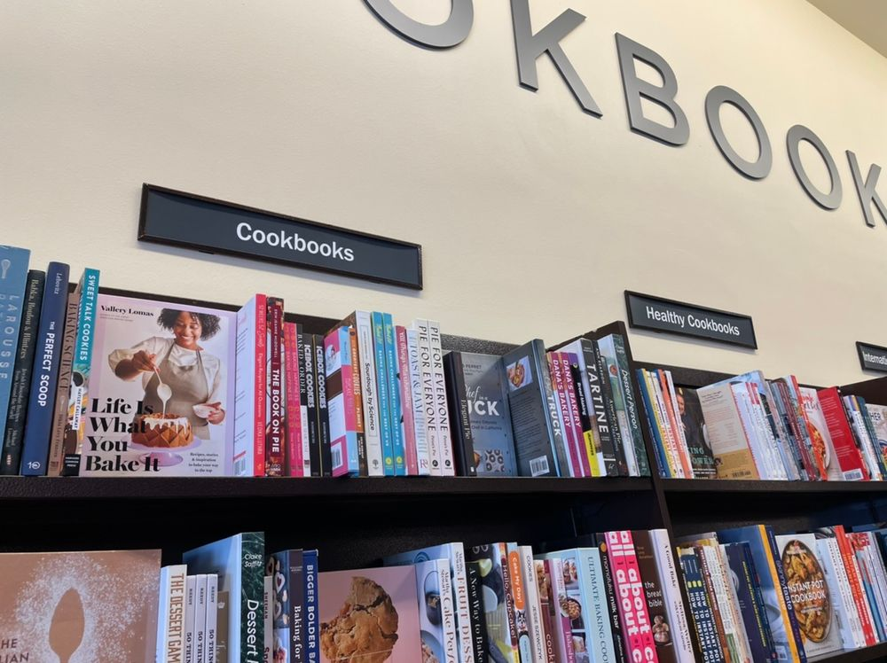

Ayer visitamos una librería [Barnes & Noble](https://en.wikipedia.org/wiki/Barnes_%26_Noble?ref=cojudeces.com). Sí, su extinción parece inevitable, pero todavía existen.

Entramos por nostalgia, para recordar ese olor particular del papel de los libros y la exploración del laberinto de títulos y de temas y sub-temas. Y también entramos por curiosidad para ver quiénes merodean este tipo de negocios (ya casi museos) en el año 2022.

Muchos de los trabajadores son los mismos de hace 15 años. Eso de que uno escoge su profesión es un mito.

Hay una nueva sección que ha ido invadiendo y asfixiando poco a poco a las demás: the children’s section. Y con razón: es la única zona con tráfico de clientes. Lo demás es estático, silencioso, los que vagabundean esos otros pasadizos no son visitantes ni clientes, sino refugiados.

## Caminante sí hay camino

Preguntamos a uno de los empleados por la sección de poesía. Dudó un momento porque “acabamos de hacer una reorganización completa de todas las secciones, por ejemplo, toda la sección de literatura (que es gigantesca) ha sido reubicada del segundo al primer piso.”

“Quién diseñó la nueva configuración de los temas y secciones?” Preguntamos.

“No lo sé.”

Enseguida, queriendo deshacerse de nosotros, indicó que la sección de poesía _should be over there._

Caminamos entre dos libreros bastante altos y largos, como si estuviésemos en un pasadizo. Sección de literatura (o _fiction_ como tristemente la bastardean aquí).

El camino desembocó en una zona amplia y peculiar. Una especia de punto panorámico desde el cual se podían ver los títulos de todos los temas del lado sur de la librería.

Como si fuese un pequeño [aleph](https://es.m.wikipedia.org/wiki/El_Aleph_(cuento)?ref=cojudeces.com), exhibiéndose de izquierda a derecha se leían los siguientes títulos:

> Cookbooks → Healthy Cookbooks → Diets & Nutrition → Health & Wellness → Natural Healing → Personal Growth → Psychology → Self-Transformation

En español:

> Libros de Cocina → Libros de Cocina Sana → Dietas & Nutrición → Salud & Bienestar → Curas Naturales (o Medicina Natural?) → Crecimiento Personal → Psicología → Autotransformación

## Peregrinaje y tragedia

Caminante, ese es el camino. Un buen día, probablemente entre los 35 y 45 años, uno despierta y siente que algo no anda bien. Inicialmente uno cree que es el deseo de mejorar. La estrella de la virtud es nuestra guía. “Quiero aprender a cocinar.”

Pero esa sensación extraña no disminuye y uno pasa de la sección de libros de cocina a la de libros de cocina sana, y después a las de dietas y nutrición.

No sabemos cómo termina este peregrinaje porque nosotros en cojudeces.com recién estamos pasando de natural healing a personal growth, pero lo que sí sabemos es que llega un momento en el cual el velo del _deseo de mejorar_ se levanta y uno ve la realidad: esa sensación extraña no es el deseo de mejorar sino el _deseo de ser otro_.

Otro. Cualquier otro. Alguien que no haya desperdiciado su juventud.

### Y ustedes qué opinan

Se logrará la redención al llegar a la fase de “autotransformación”? Es una palabra bien grande. Lo dudamos. Envíanos un email a mediodiablo@cojudeces.com.