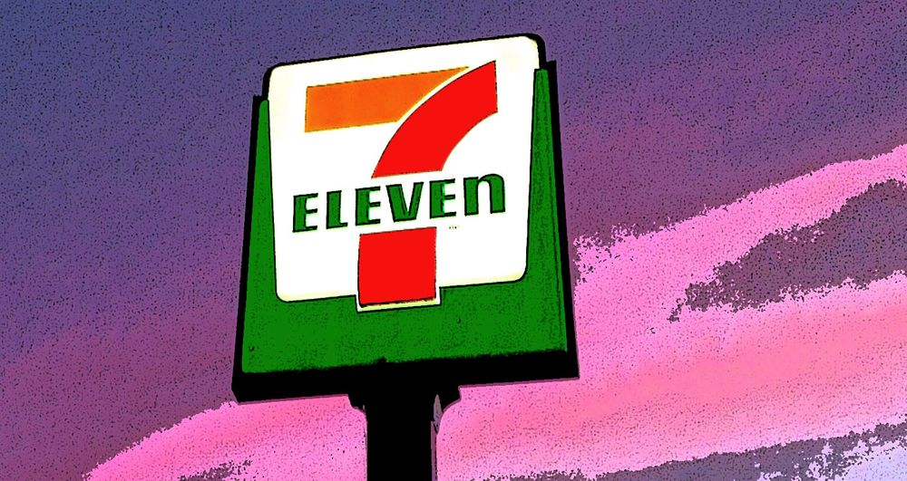

Esta semana estuve de visita por Silicon Valley. Escogí un hotel a ojos cerrados. Pensé que era el Sheraton pero resultó siendo el Four Points by Sheraton. _There’s a distinction there_.

## Zona Maloy

Bueno, eso no interesa, el tema es que este Four Points estaba metido en una zona un poco maloy y que tenía hambre. Me dijeron en recepción que a dos cuadras había una taquería.

Era en una zona semi comercial venida a menos. Había talleres mecánicos seguidos de oficinas de consejería marital y de algunos comercios ya quebrados. Era raro, pero no casi no había gente en la calle con excepción de vagabundos con el cerebro ya quemado. Seguí caminando hasta que encontré la taquería.

Un local amplio y vacío a esas horas de la tarde. Mientras almorzaba, el celular señaló que la batería se estaba acabando. Busqué el cargador en mi maletín, en mis bolsillos, en el maletín nuevamente. Nada.

No hay problema, pensé, busquemos un 7-Eleven. El mapa indicaba uno a cuatro cuadras.

## 7-Eleven

Decidí regresar al hotel a cambiarme de ropa de trabajo a jeans y polo. “En esta zona maloy, mientras más zarrapastroso, mejor”, pensé.

Camino a 7-Eleven ya se veía más gente y más autos y a la vez me sentía más desprotegido. Creo que el solo hecho de vestir ropa de mi talla me delataba como un extraño, un alien. Erguí el cuello lo más que pude para disimular el miedo y seguí adelante.

Finalmente llegué a 7-Eleven. Al entrar me di cuenta de que no estábamos en Tailandia (breve anuncio de servicio público: cuando vayan a Tailandia, visiten un 7-Eleven y van a ver… o vean este [video](https://youtu.be/6bt9XdpfFyI?ref=cojudeces.com)). También me di cuenta de que los pocos personajes que deambulaban por la tienda se detuvieron a mirarme de pies a cabeza.

El lugar estaba, como todos los 7-Elevens de este país, yéndose a la mierda pero aún con vida.

## Tarantino y Scorcese

Tomé una botella de Mountain Dew y esperé mi turno para pagar y comprar el maldito cable del iPhone.

Delante de mí estaba un individuo con pinta de pandillero matón. Tendría entre 35 y 40 años, una mezcla de gringo y de latino, con la cabeza rapada, bigotes, tatuajes por todas partes, y vistiendo la típica camiseta blanca sin mangas y un short de blue jeans que le llegaba hasta los tobillos.

El tipo estiró el brazo hacia abajo, y lo estiró un poco más, hasta que encontró el bolsillo del short y produjo algunos billetes.

En un inglés chaveteado le preguntó al encargado algo que nadie entendió. Tuvo que repetirlo dos veces antes de poder procesar sus intenciones: quería comprar un gift card y preguntaba cuánto costaba.

El encargado dijo: $4.99.

El tipo tiró un billete de $5 en la mesa.

Luego tiró dos billetes más de $5 y tres de $1.

“Pon TODO eso en la tarjeta!”, exigió el personaje.

Hablaba de manera prepotente. El encargado obedecía. Todos en la fila nos manteníamos en silencio, como si fuésemos rehenes.

El tipo volteó y me miró. Se quedó mirando un momento. Erguí un poco más el cuello y miré al lado (haciendo la finta de que me interesaba un paquete de galletas) pero estaba muy al tanto de sus movimientos. Vi que metió la mano al bolsillo y pensé que buscaba su arma… pero sacó un billete de un dólar y se dirigió nuevamente al encargado.

Lanzó el billete y dijo “añade este dinero a la tarjeta _**immediately!**_”

Mientras el encargado añadía esta última centena de centavos a la tarjeta, el matón volteó nuevamente y me dijo “y tú qué miras”.

Lo que este pobre personaje de escena de Tarantino no sabía era que yo ya me había visto todas las películas y que además había visto y memorizado una de Scorcese. Así que puse cara de De Niro y le contesté:

> **You Talkin’ to Me? You Talkin’ to Me? Then who the hell else are you talkin’ to?**

… well I’m the only one here… ↓

<iframe width="560" height="315" src="https://www.youtube.com/embed/-QWL-FwX4t4?si=VWh673-IX4Ff6fEd" title="YouTube video player" frameborder="0" allow="accelerometer; autoplay; clipboard-write; encrypted-media; gyroscope; picture-in-picture; web-share" referrerpolicy="strict-origin-when-cross-origin" allowfullscreen></iframe>