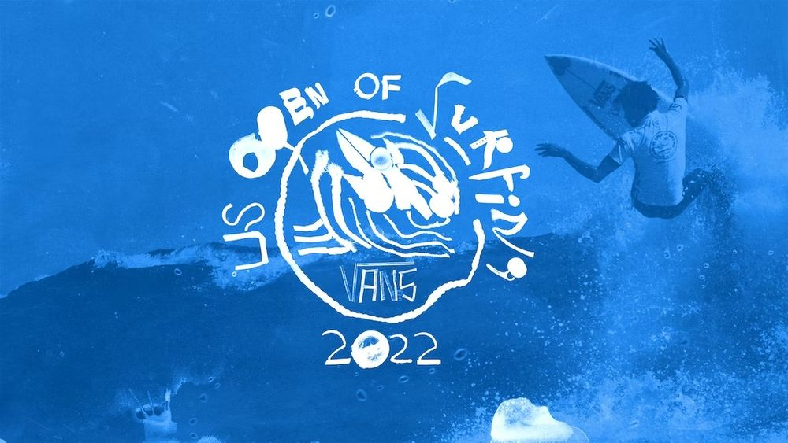

El 7 de agosto fuimos a Huntington Beach a ver las finales del Vans U.S. Open of Surfing. Son aproximadamente 72 millas (115 kilómetros) desde aquí hasta HB, así que no visitamos con frecuencia, pero cada vez que vamos, nos deleitamos con la atmósfera playera, relajada y sin poses de la conocida Surf City.

Tanto nos gusta que desde hace años soñamos con comprar una casita por ahí, en algún rincón no muy alejado de la playa. Y hace un par de meses empezamos a ver casas a través de Zillow y videos en YouTube para entender mejor cómo están distribuidos los vecindarios.

Nos emocionamos y pensamos que ya nuestro plan estaba en marcha. Pero pasó algo curioso. Estábamos almorzando con un amigo nacido y crecido en Orange County y, cuando tocamos el tema Huntington Beach, frunció un poco el ceño y dijo “piénsenlo dos veces, es una ciudad muy bonita pero atrae mucho riff raff los fines de semana.”

Riff raff.

Una semana después, visitando a otro amigo también nativo de la zona, se usó el mismo término: “yo no compraría en HB, hay mucho riff raff sobre todo en fines de semana.”

Otra vez riff raff?

Busquemos en el diccionario.

> “gente, o un grupo de gente, considerada despreciable.” “Gentuza.”

Qué raro que ambos amigos (que no se conocen entre ellos y que trabajan en diferentes profesiones y etc.) hayan utilizado el mismo término.

Y más interesante nos pareció que nuestras visitas a Surf City hayan sido siempre durante fines de semana y que nunca hayamos visto lo que nuestros amigos desdeñosamente llaman riff raff. Así que, con el [Vans U.S. Open of Surfing](https://www.vansusopenofsurfing.com/2022/surf?ref=cojudeces.com) tomando lugar en Huntington Beach y fecha del 30 de julio al 7 de agosto, el domingo en que se disputaban las finales nos levantamos antes del amanecer y salimos rumbo al sur con los cinco sentidos afinados para detectar el famoso riff raff.

Y nada. La pasamos muy bien y, como siempre, la atmósfera relajada y cool y surfera y buena onda.

“Aquí no hay riff raff!” exclamamos algo molestos. Pero secreta y silenciosamente, mientras bajábamos del muelle a la playa, no podíamos dejar de pensar en ese dicho de la gente que juega poker:

> “Mira alrededor de tu mesa, si no sabes quién es el lorna, entonces tú lo eres.”
