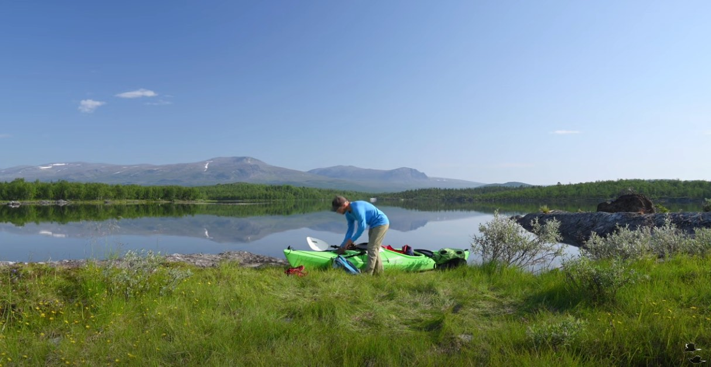

La historia del Silent Solo Hiking (SHH) es corta. No llega a los cinco años. Sin embargo, con el ascenso de Harmen Hoek, nos preguntamos si ya se ha conquistado la cumbre de este tipo de films. El tiempo lo dirá.
Aquí tres filmmakers que representan diferentes etapas de SHH.

## Prehistoria: Erik Normark
En la prehistoria o protohistoria de SHH, existió (y aún vive) Erik Normark.
Hace más de 5 años que Normark viene publicando videos explorando la naturaleza. Va despacio y en silencio. Solamente se oyen los sonidos del bosque o del lago. Sus videos transmiten la calma y la espaciosidad del mundo natural.
Por ejemplo aquí explorando en kayak y acampando en Tjeggelvas en el norte de Suecia.\
Denle click a la imagen.

## Ascensión: Kraig Adams
Pero fue en el año 2019 cuando se definió el **"género"** SHH cuando Kraig Adams posteó varios documentales de viajes caminando y acampando solo durante varios días en las montañas.
Revisando su canal de YouTube, el primer video de SSH que lanzó fue en Islandia, en una caminata de cuatro días y casi 100 kilómetros en Hornstrandir.\

(*Nota: hay un video anterior que toma lugar en el Perú y que prometía ser el origen de SSH, "Solo Hiking the Choquequirao Trek Peru", pero desafortunadamente falla en el tema "silent"*)\
Hay videos impresionantes sobre Alaska, el Gran Cañón, el Perú, Nepal. 
En las propias palabras de Kraig, la idea de filmar sin abrir el hocico fue simplemente la de capturar las cosas como son: porque cuando se hace una caminata solo, se va en silencio y se va despacio.
"I want some inspiration and less forced happiness and forced positivity. It just doesn’t really make sense if you’re out there hiking to fake it and make it not what it is. Hiking alone is kinda boring when you think about it."

## Apogeo: Harmen Hoek
El 2022 descubrimos a quien creemos ha llevado los films SSH a su máxima expresión: Harmen Hoek. Afortunadamente para nosotros, en febrero del 2023, la energía de Hoek para crear documentales continúa intacta.
En nuestra humilde opinión, Hoek es el más talentoso de todos. La composición de escenas, astrofotografía, sus time lapses, el uso drones, y el arte de narrar en silencio se acercan a la perfección.
En YouTube, alguien comenta: "This is pure art like music , poetry, writing, and painting, an undescribable connection to the collective soul." 
Aquí capturamos una imagen de su film [Solo Hiking 150km in Los Picos de Europa](https://youtu.be/NASElBP0AnM).

Hoek también es el más aguerrido. Sus expediciones son más largas y muchas veces tiene que soportar y prevalecer frente a la inclemencia del clima. Y ni qué decir acerca del esfuerzo y paciencia para encuadrar una escena, ensamblar el equipo de filmación y luego retroceder a veces kilómetros para poder filmarse a sí mismo... una y otra vez. Es también **solo filming**.

## El futuro
No sabemos si hemos llegado ya al cénit en el tema SSH. Tampoco sabemos si Kraig Adams retomará la punta. Nos parece poco probable, sobre todo porque se ha distraído. Ya no está soltero y al parecer lo han obligado a publicar videos de la esposa y del perrito y de la mudanza interestatal. Todo muy bonito, pero son cojudeces.
Hoek entonces queda coronado como rey. Tal como escribió y describió Steven Runciman en su historia de las Cruzadas a Baldwin I, Rey de Jerusalén:
"Pero Baldwin había esperado su momento y había aprovechado sus oportunidades. De todos ellos, él había demostrado ser el más capaz, el más paciente y el más previsor. Había ganado su recompensa; y el futuro demostraría que se lo merecía. Su coronación fue gloriosa y dio un final esperanzador a la historia de la Primera Cruzada."

---

### posdata 1
- Comentarios, recomendaciones de otros solo hikers, por favor a cojudeces@cojudeces.com 
### posdata 2
- Link al canal de Harmen Hoek: https://www.youtube.com/@HarmenHoek
- Un consejo para Harmen: busca un nombre artístico tipo "Prince" porque está bien jodido recordar tu nombre
- Entrada de Wikipedia sobre el libro de Runciman: https://en.wikipedia.org/wiki/A_History_of_the_Crusades

