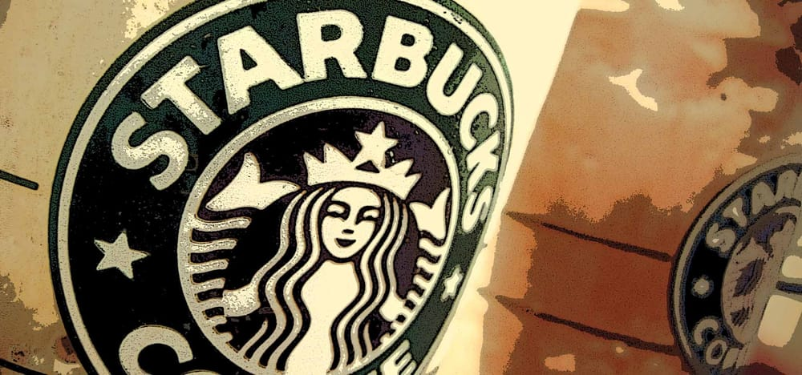
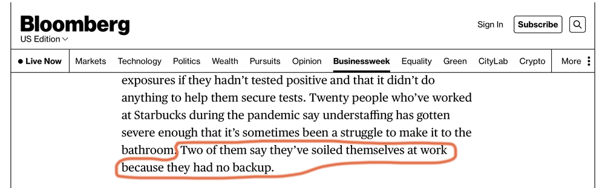

Esta mañana, como muchas mañanas, pasamos por nuestro Starbucks de siempre y saludamos a la gente de siempre. Notamos que muchos de los baristas son nuevos, y es bueno ver que son igual de amables que los veteranos.

Starbucks, desde que tenemos memoria, siempre nos pareció un lugar en el cual los empleados la pasan bien. Nuestra percepción no se basa solamente en nuestra experiencia como consumidores sino también en [Howard Schultz](https://en.wikipedia.org/wiki/Howard_Schultz?ref=cojudeces.com) repitiendo ad nauseaum que su compañía es un lugar feliz que expresa los valores de la amabilidad, la dignidad, y el respeto en el trato de sus empleados y clientes.

Es por eso que nos sorprendió encontrar este artículo publicado en la edición de Mayo 16, 2022 en Bloomberg Business Week acerca del creciente número de locales de Starbucks en los que los baristas están buscando organizarse como sindicato. Los beneficios que reciben los baristas no son terribles, dicen, pero dejan mucho que desear.

La nota periodística, escrita por un tal Josh Eidelson, narra el desarrollo de esta nueva tendencia hacia la sindicalización de manera sobria y mesurada durante aproximadamente 1700 palabras, hasta que no puede más y añade este párrafo para aderezar un poco el caramel macchiato.

> Twenty people who’ve worked at Starbucks during the pandemic say understaffing has gotten severe enough that it’s sometimes been a struggle to make it to the bathroom. **Two of them say they’ve soiled themselves at work** because they had no backup.

Luego retoma el control de sí mismo y vuelve a adoptar la seriedad debida.